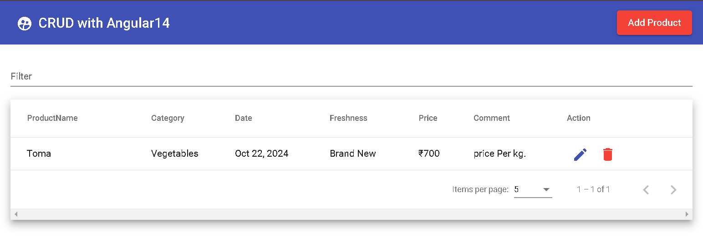
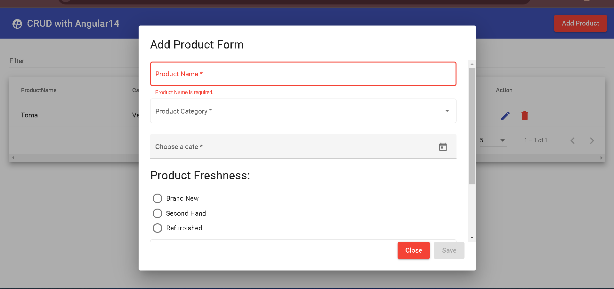
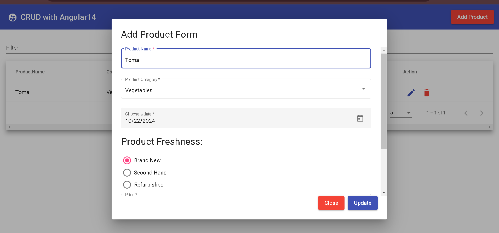
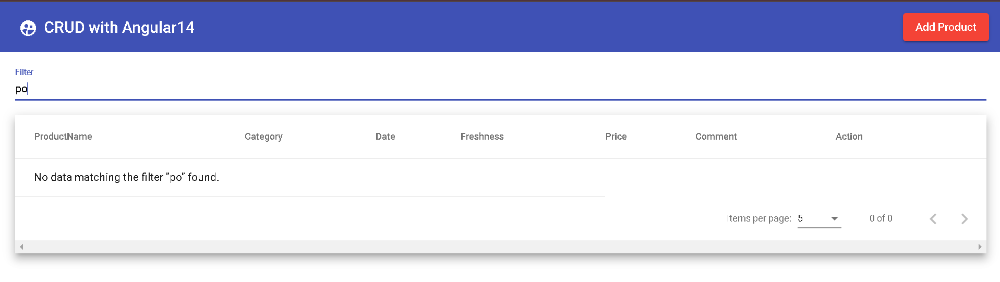

# CRUD APPLICATION

A simple Angular14 application for managing products with CRUD (Create, Read, Update, Delete) operations. This app utilizes **Angular Material14** for the UI components and **json-server** to mimic a RESTful backend.

## Table of Contents

- [Snapshots](#snapshots)
- [Features](#features)
- [Technologies Used](#technologies-used)
- [Installation](#installation)
- [Usage](#usage)
- [API Endpoints](#api-endpoints)


## Snapshots

### Home Page


### Add Product - Reactive Model with Validations


### Auto Form Data Populate on Edit of Product


### Filter Product



## Features

- Add new products to the inventory using a user-friendly dialog form.
- Update existing product details in the same dialog.
- Delete products from the inventory.
- View all products in a sortable and paginated table.
- **Pagination**: Default set to display 5 products per page with the option to view 10, 25, 50, or 100 products per page.
- Filter products by name, category, and other attributes.
- Responsive design utilizing Angular Material components for better user experience.

## Technologies Used

- **Angular**: Frontend framework.
- **Angular Material**: UI component library for Angular, providing modern design components like buttons, tables, dialogs, and more.
- **json-server**: Mock REST API for rapid development.
- **TypeScript**: Superset of JavaScript used for building the application.

## Installation

### Prerequisites

- Node.js and npm installed on your machine.
- Angular CLI installed globally.
- Install json-server to mimic Restful api 
        ```bash
        npm install -g json-server@0.16.3
        json-server --watch db.json
        ```
- To avoid @types/node or typescript or node version error , try to keep versions same as of dev-dependecies in package.json.

### Steps

- Clone the repository 
- install and run json-server on system.
- run npm i
- ng serve 

## Usage

- Click on the "Add Product" button in the navigation bar to open a dialog where you can enter product details.
- Fill in the required fields in the form and click "Save" to add the product to the inventory.
- Click on any product in the table to edit its details using the same dialog.
- Click the "Close" button to dismiss the dialog.
- Products can be deleted using the delete action (trash icon) in the table.
- Pagination: The product table displays 5 products by default. Use the pagination controls at the bottom of the table to navigate through additional pages. You can also change the number of products displayed per page (5, 10, 25, 50) using the page size options.


## API Endpoints

| Method | Endpoint           | Description                       |
|--------|--------------------|-----------------------------------|
| GET    | `/products`        | Get all products                  |
| POST   | `/products`        | Add a new product                 |
| PUT    | `/products/:id`    | Update an existing product        |
| DELETE | `/products/:id`    | Delete a product                  |